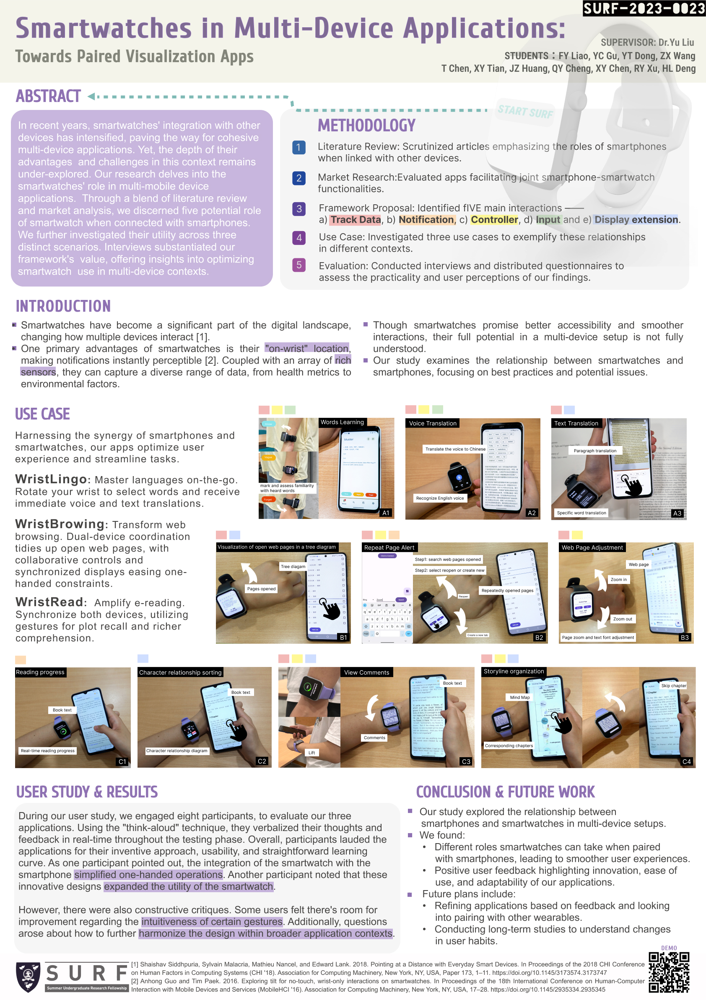

This paper was extended by XJTLU's summer research.
I and my group designed and built highly visual integration between smartwatches and smartphones in diverse scenarios such as standing, walking, and sitting through Android Studio technology, generating ideas for innovative applications, as well as providing in-depth evaluation and precise feedback on the resulting applications, and co-writing the academic paper reflecting the project results. 

